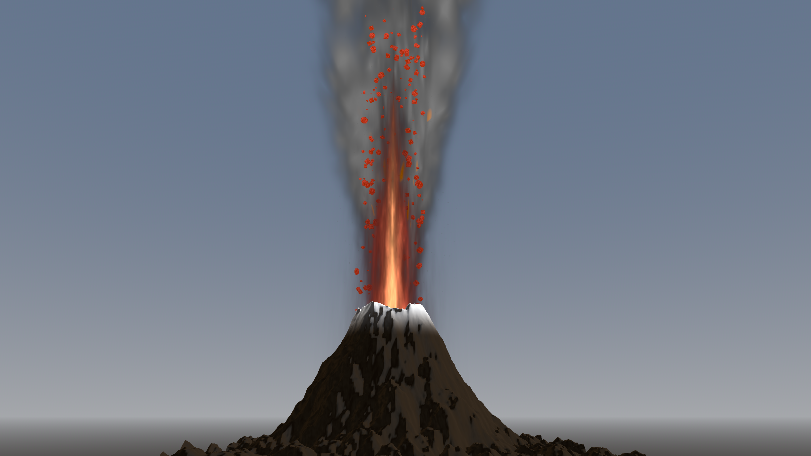

# Volcano 3D Simulation

A real-time 3D volcano eruption simulation built with Godot Engine for a Computer Graphics course project.

## Preview



## Requirements

- Godot Engine 4.6 or newer
- Forward+ renderer

## Setup

1. Clone this repository.
2. Open Godot Engine.
3. Import `project/project.godot`.
4. Open `project/scenes/main.tscn`.
5. Press `F5` to run the simulation.

## Controls

| Key | Action |
| --- | --- |
| `Space` | Trigger smoke, flame, and lava chunks |
| `V` | Lower the flame billboards |
| `W` / `A` / `S` / `D` | Move the camera |
| `Q` / `E` | Move the camera up or down |
| `Shift` | Boost camera movement speed |
| `Tab` | Capture the mouse cursor |
| `Esc` | Release the mouse cursor |

## Features

- Procedural volcano mesh displacement and crater lava shading.
- MultiMesh-based smoke and lava chunk emitters.
- Custom smoke, flame, lava pool, and terrain shaders.
- Free-fly debug camera for scene exploration.
- Tween-controlled eruption reveal animation.

## Project Structure

```text
project/
  materials/          Normal maps and flow textures
  scenes/             Godot scene files
  scripts/
    camera/           Free-fly camera controller
    controllers/      Eruption trigger and animation logic
    emitters/         Smoke and lava particle systems
  shaders/
    effects/          Flame, smoke, and lava burst shaders
    particles/        MultiMesh particle shaders
    terrain/          Volcano and lava pool shaders
```

## Notes

The particle systems use a structure-of-arrays layout so each frame updates only active particles and keeps removal cheap through swap-removal.
